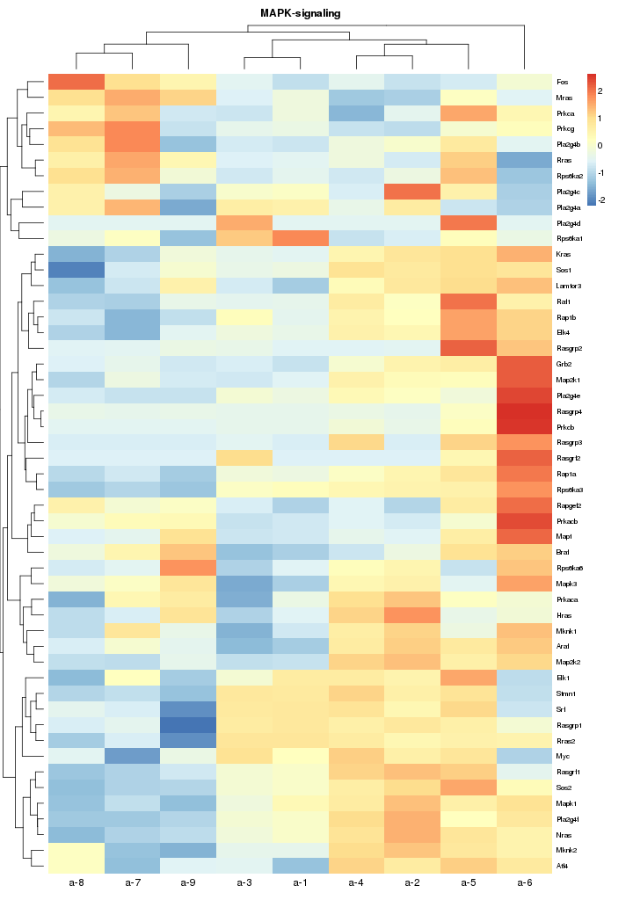
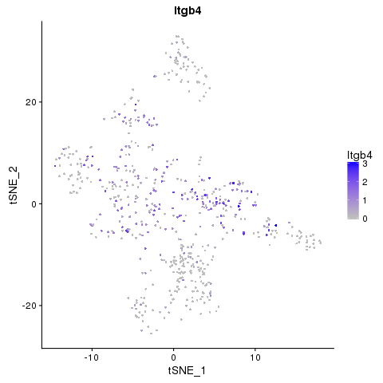
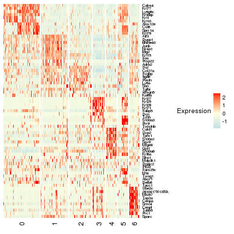
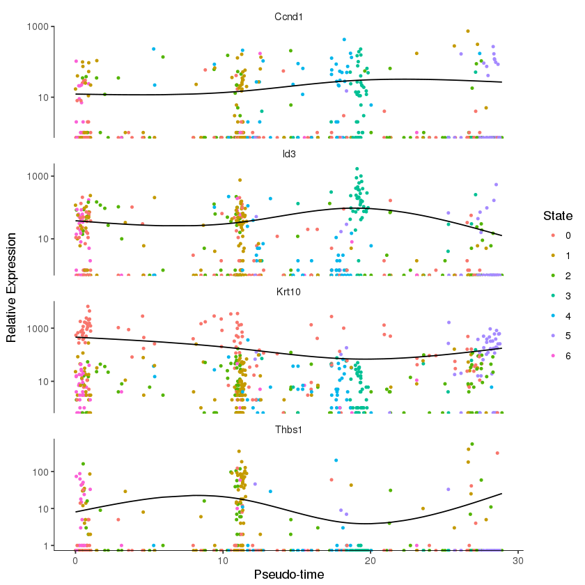
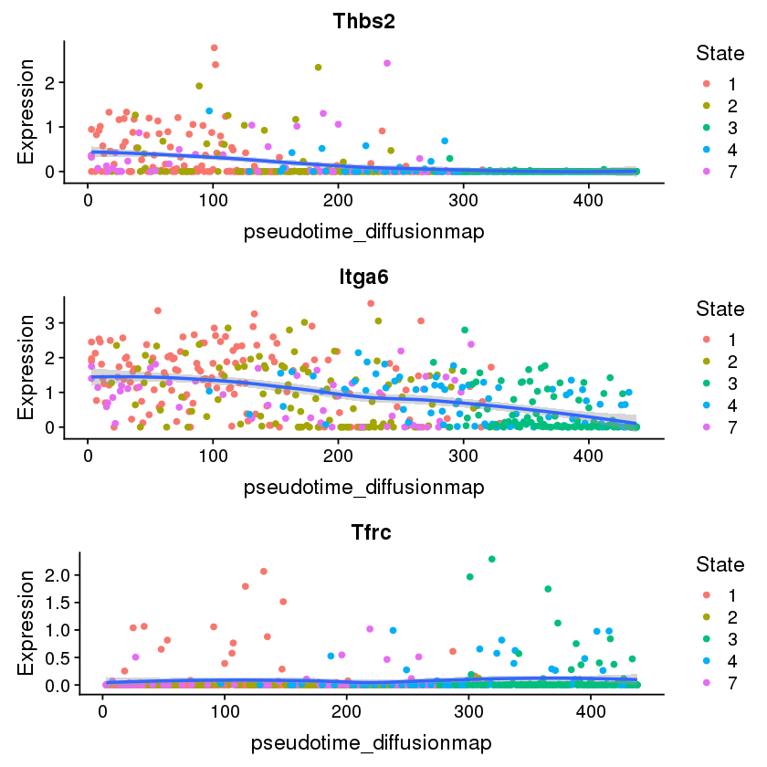

# This is the code for WeiYa'paper

##    Differential Expression of α6 and β1 Integrins in Skin Epidermis Reveals Stem Cell Behavior and Heterogeneity at Single-Cell Resolution

### 环境：R
主要工具包：Seurat,ggplot2,NMF,jupyter-notebook等

分析主要分为两块，单细胞和多细胞分析，分析过程大同小异，分析过程参考[Seurat](https://satijalab.org/seurat/)

[tools.R](./tools.R)自己已往分析单细胞积累的函数集合（很辣鸡的代码）

[process.R](./process.R) 数据预处理的过程

### 数据
[单细胞数据](./SingleCellData)在SingleCellData文件夹里

[多细胞数据](./a-9_geneCounts.csv)在a-9_geneCounts.csv文件

以上数据都是**geneCounts**形式的数据

### 分析

* Step 1: 多细胞
[Mult_Ananlysis](./Mult_Ananlysis.ipynb)整一个分析过程都在这个文件，可以参考下

##### 示例图

当然，分析主要也是等到*tsne,cluster,heatmap*等这些可视化图

* Step 2: 单细胞
这个过程跟多细胞的差不多
[SingleCell-Analysis](./SingleCell-Analysis.ipynb) 单细胞分析过程

##### 示例图

* Step 3伪时间分析
[SingleCell-Pseudotime](./SingleCell-Pseudotime.ipynb)主要用[monocle](https://cole-trapnell-lab.github.io/monocle-release/)分析
分析流程参考monocle教程

文件夹主要是放一下保存的图片，比如SingleCellPlot，Picture，以及一些其他的文件，都是一些分析留下的笔记而已，哈哈

